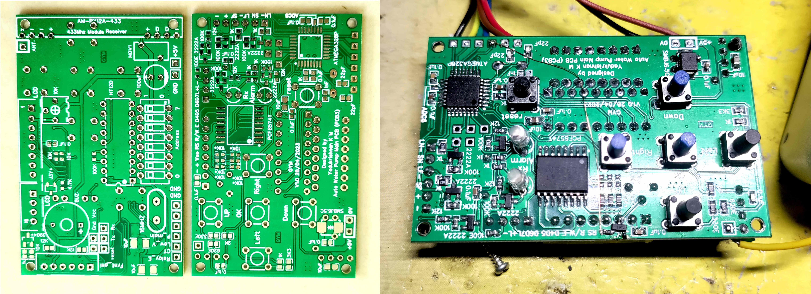
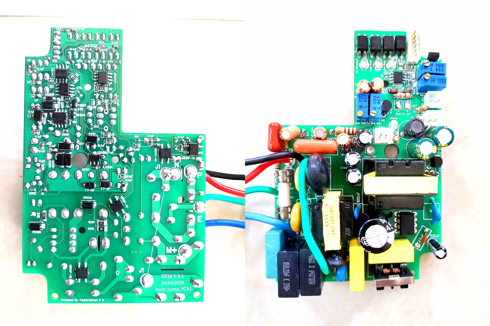
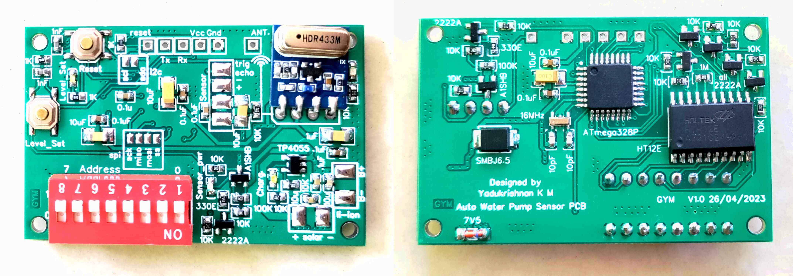
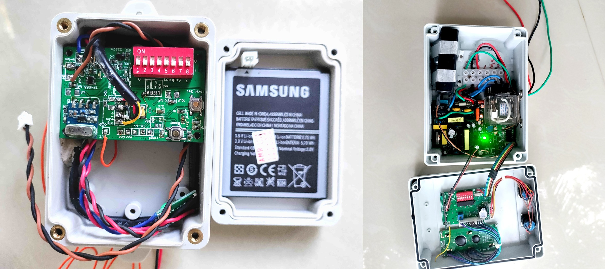

# Intelligent Water Pump Controller (1HP) with Wireless Sensor Unit
This folder contains all the necessary files and documents related to the hardware development of the project.
The project includes three separate PCBs:

>1. Main Controller PCB
2. Main Controller Power PCB
3. Sensor Unit PCB

Each PCB design is stored in its own folder. There are no different versions available yet—only one prototype has been built and is currently in use. Some minor bug fixes have been applied using jumper wires on the PCBs.

## Main Controller PCB

This is the main *"brain"* of the controller unit. It uses an **ATmega328P** microcontroller running with an external 16 MHz crystal for accurate timing. The entire board operates on 5V, which is supplied from the separate Power PCB. To protect against voltage surges and spikes on the power input, a surge arrestor (MOV and TVS diode) is included, along with smoothing capacitors to provide clean DC power. Additional ceramic decoupling capacitors are placed close to the Vcc and GND pins of the microcontroller to reduce any noise or voltage fluctuations.  

User interaction is handled through a simple button interface using a potential divider (resistor ladder) connected to one analog input (ADC pin) of the microcontroller. Pressing different buttons changes the voltage level at the analog pin, allowing the microcontroller to detect up to 5 different button actions using just one ADC channel. The buzzer and LEDs are driven by NPN transistors to prevent overloading the microcontroller's output pins. A reset switch is also provided to manually reset the system.  

Wireless communication is achieved using a 433 MHz RF transmitter/receiver pair along with **HT12D** decoder IC.

* The RF receiver module receives signals at 433 MHz.
* The received serial data goes to the DIN (Data In) pin of the **HT12D**.
* The **HT12D** decodes the data only if the address bits (set by the DIP switches on both transmitter and receiver) match exactly.
* Once valid data is decoded, the **HT12D** outputs the 4-bit parallel data on pins D8–D11.
* The VT (Valid Transmission) pin (pin 17) goes HIGH when valid data is successfully received and decoded—this pin is connected to a microcontroller interrupt pin to immediately alert the **ATmega328P** that new data is available.
* The decoded data lines from **HT12D** are connected to regular digital input pins on the microcontroller.

A **PCF8574T** I2C I/O expander IC is used to interface with the LCD display. This chip converts I2C serial communication from the microcontroller into parallel signals needed for the LCD, saving many microcontroller pins that would otherwise be required for direct LCD control. This forms the basic hardware setup of the Main Controller PCB.

## Main Controller Power PCB

This PCB is the power supply section for the entire main controller unit. It handles all the power electronics, converts mains AC to the required DC voltages, provides battery backup, monitors the motor and input AC voltage, and drives the main relay.

The AC input from the **230V** mains first passes through a **fuse** for basic **overcurrent** protection. After the fuse, **surge arrestors (MOV)** are connected between phase and neutral, phase and earth, and neutral and earth. These protect the circuit from lightning strikes, voltage spikes, and other power line disturbances. The phase wire then goes through a current transformer. This **current transformer** is used to sense how much current the motor is using. It helps detect **dry running** problem. Some AC capacitors are added at the input side to improve the power factor and reduce harmonics.

The main power conversion is done using an SMPS based on the **VIPer22A** IC. This SMPS converts the high-voltage AC into low-voltage DC outputs. It produces a clean **+5V** supply for the microcontroller circuits, and a **+12V -12V** supply for operating the relay. Standard EMI filters, rectifier, transformer, output inductors, and capacitors are used for clean and stable output without making any EMI issues. A 6.2V zener diode is also placed on the 5V line as an extra safety measure to prevent any voltage from going too high.

A capacitive voltage divider circuit is used to detect the presence of AC mains voltage. This gives a signal when mains power is available and helps the system know when there is a power failure. To protect the motor from low voltage or dry run conditions, an **LM358** op-amp comparator circuit is used. It checks both the AC input voltage level using capacitive voltage divider and the motor current level coming from the current transformer. The reference voltage for comparison is created using a **TL431** precision reference IC. Multi-turn potentiometers are provided so the user can adjust the exact **low-voltage cutoff** and low-current **(dry run)** threshold. The outputs from these comparators go to the main microcontroller through optocouplers to keep complete electrical isolation.

The relay that controls the 1HP motor is also driven from this Power PCB. A **2SD882** NPN power transistor is used to switch the 12V relay coil. An indicator LED shows when the relay is active. The control signal from the microcontroller reaches this board through an optocoupler to maintain isolation between the low-voltage control side and the high-power relay side.

Battery backup is supported for both **Li-ion** and **lead-acid** batteries. For Li-ion batteries, charging is handled by the **TP4056** IC. This chip takes care of the full safe charging process with constant current and constant voltage stages.

For lead-acid batteries, a discrete charging circuit is used. It includes comparators, a **555** timer IC, and transistor switches. The circuit has two charging modes. In normal mode, it provides higher current to charge the battery when the battery voltage is low. Once the battery reaches full charge, it switches to **trickle** (float) mode using a PNP transistor to maintain the battery with a small current. Charging starts automatically when the battery voltage drops below a set level and stops when it reaches the full voltage. Multi-turn potentiometers allow adjustment of the start and stop voltages for charging.

The 5V supply for the main board is selected automatically using a single diode. When the SMPS is working, it supplies 5V and the diode keeps the battery disconnected. When mains power fails and the SMPS turns off, the diode connects the battery to the 5V line. The battery voltage will be slightly lower than 5V, but it is still enough for the microcontroller to keep running basic functions, show water level and warnings, or maintain the system state.

## Sensor Unit PCB

This is a fully wireless sensor board designed to measure water level and transmit data to the main controller. It operates entirely on battery power, with charging provided by a small solar panel. No external power supply or wiring is needed, making it ideal for remote installation near the water tank.

The core of the board is an **ATmega328P** microcontroller, the same type used in the main controller. A 16 MHz crystal footprint is provided on the PCB, but the design also supports running without an external crystal using the internal 8 MHz oscillator for lower power consumption. Decoupling capacitors are placed close to the microcontroller's power pins to keep the supply stable and reduce noise.

Data transmission happens wirelessly at 433 MHz using an RF transmitter module. To send the data, an **HT12E** encoder IC is used. The encoder's address is set with a DIP switch to match the receiver side (HT12D in the main controller). The microcontroller sends the 4-bit parallel data to the **HT12E** inputs. Since the microcontroller's logic low output may not pull low enough for reliable encoder operation, an NPN transistor (acting as an open-collector driver) is used to ensure a clean 0V low level on the data lines. This requires the software to invert the logic levels (flip high/low) when sending data to compensate.

An **ultrasonic sensor** (typically **HC-SR04** or a waterproof variant) is used to measure the distance to the water surface, which helps calculate the tank level. Connection pads are provided on the PCB for easy attachment of the sensor. The RF transmitter module, **HT12E** encoder, and ultrasonic sensor are powered only when needed to save battery life. A **P-channel MOSFET** (marked as **A1SHB**, equivalent to **SI2301** or similar low-voltage P-MOSFET) is used by the microcontroller to switch power to these components. The MOSFET gate is controlled directly from a microcontroller pin.

Power comes from a single Li-ion cell (typically 3.7V nominal). No boost converter is used—the entire circuit runs directly from the battery voltage, which is sufficient for the **ATmega328P** (down to about 2.7–3V depending on clock speed), ultrasonic sensor, and low-power RF module.

Solar charging is handled through a dedicated input for the solar panel. Protection starts with a TVS diode and a 6.8V zener diode to clamp any voltage spikes or surges from the panel. Charging is managed by the **TP4055** IC (a compact linear Li-ion charger, similar to TP4056 but in SOT23-5 package), which provides constant current/constant voltage charging with thermal regulation and basic protection.

For user interaction, the board includes one push button (for configuration or testing) and a few indicator LEDs to show status like charging, transmission, or user feedback. A separate reset button is also provided to restart the microcontroller when needed.

This design keeps power consumption very low by sleeping most of the time, waking up periodically to measure the level, transmit data briefly, and then return to deep sleep—allowing long operation from a small solar-charged Li-ion battery even in low-light conditions.

## Mechanical Design

Both the main controller unit and the sensor unit are housed in **IP67/IP65 rated plastic enclosures**. This rating ensures the boxes are completely dust-tight and can withstand temporary immersion in water, making them waterproof and durable for reliable long-term use. The enclosures are made of tough plastic (typically ABS or polycarbonate) to provide good mechanical strength and protection against impacts, UV exposure, and harsh outdoor conditions. The PCBs were custom-designed to fit perfectly inside these enclosures, leaving enough space for wiring, components, and mounting.

The main controller unit is usually installed indoors (e.g., inside the home or a protected area), so full IP67 protection is not strictly necessary for it, but using the same waterproof enclosure adds extra safety and future-proofing. The sensor unit, however, is placed outdoors near the water tank, so it requires full IP67/IP65 protection. After drilling holes in the enclosure for the ultrasonic sensor cable, solar panel cable, and any other connections, all openings are carefully sealed to make the holes completely watertight and maintain the IP67 integrity.

>**Enclosure details** 

>**Sensor Unit:**  
Model name: **WJB17** (IP65 Waterproof GPS/Automation Enclosure)    
Price (INR): **299.00**   
Purchase date: NA  
Website: [https://vkenterprises.tech/product/ip65-waterproof-gps-automation-enclosure-wjb17/](https://vkenterprises.tech/product/ip65-waterproof-gps-automation-enclosure-wjb17/)

>**Main Controller:**  
Model name: **ID-9105Z** (Company name - IDIDEAL)    
Price (INR): **990.00**   
Purchase date: NA  
Website: Purchased offline 

